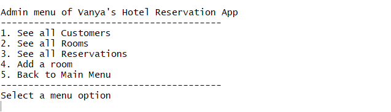

# Udacity hotel reservation app

## Description
This is my implementation of the first (out of three) project in Udacity's Java Programing Nanodegree.

I wrote this console app from scratch based on architecture suggested in the course. The project demonstrates designing
classes using OOP, organizing and processing data with collections, and using common Java types.

This app allows customers to find and book a hotel room based on room availability. The following screenshots
demonstrate the functionality implemented.

Main menu:\


Admin menu:\


## How to clone the repo in terminal
```bash
git clone https://github.com/IvanZet/udacity-hotel-reservation-app.git ivans-hotel-app
```

## How to run it in IDEA
Open `src/main/java/com/udacity/hotel/HotelApplication.java` file and run the `main()` function.

## How to run it in terminal
Navigate to `src/` dir of the project
```bash
cd ivans-hotel-app/src/main/java
```
Compile the project
```bash
javac com/udacity/hotel/HotelApplication.java
```
Run the app
```bash
java com.udacity.hotel.HotelApplication
```

## TODO
- [x] Add how run it
- [x] Add description
- [x] Add JavaDock for methods, especially public ones
- [x] Add unit tests
- [x] Clean FIXME and TODO tags
- [ ] Fix IDEA’s standard linter errors
- [ ] Add IDEA's plug-in to catch code style errors (Sonar) and fix errors

## TODO optional
- [x] Catch exceptions later in UI?
- [x] Ensure that entered check in date is earlier that check out date
- [ ] Validate check-in and check-out dates in constructor of Reservation class
- [x] Fix duplicate booking
- [x] Refactor suggesting other dates
- [ ] Sort elements in collections when printing them (reservations, customers)
- [ ] Add option to add a room using FreeRoom class
- [x] Make classes final where applicable
- [x] Check PROJECT SPECIFICATION
- [ ] Add variables' values to exception messages
- [ ] When dates are printed to console, truncate time

## TODO new features
- [ ] Customize the find-a-room method to search for paid rooms or free rooms.
- [ ] Provide a menu option from the Admin menu to populate the system with test data (Customers, Rooms and Reservations).
- [ ] Allow the users to input how many days out the room recommendation should search if there are no available rooms.
